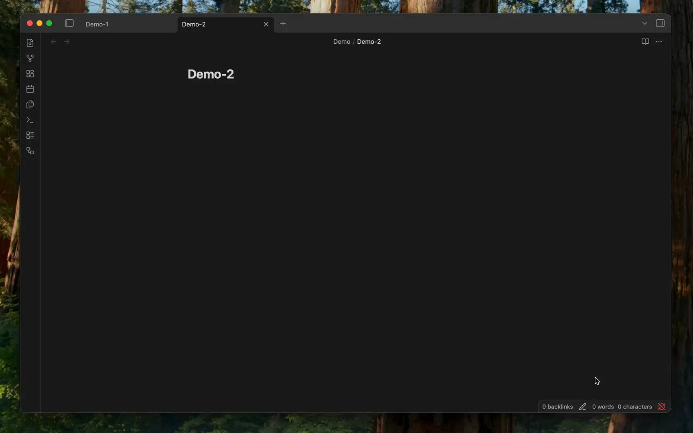
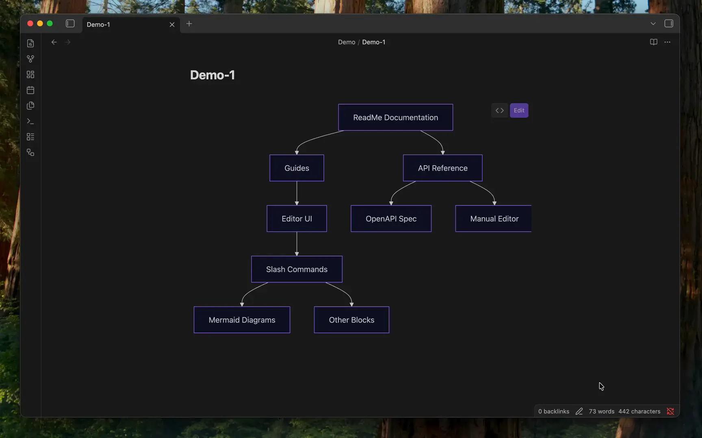
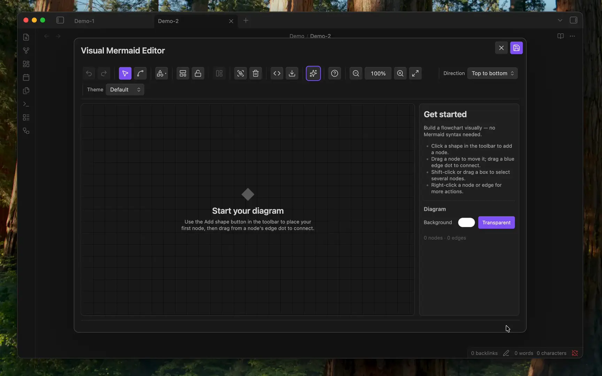

# Mermaid Flow

**A visual, drag-and-drop editor for [Mermaid](https://mermaid.js.org/) flowcharts inside [Obsidian](https://obsidian.md/).**

Build and rearrange diagrams by moving nodes and drawing connections — Mermaid Flow writes the underlying `mermaid` code for you, so no syntax knowledge is required.

**☕ Like Mermaid Flow?** [Support me on Ko-fi](https://ko-fi.com/P0R02009G7) • Use the **Send feedback** command to share ideas

Your edits **round-trip safely**: Mermaid Flow reads your existing Mermaid blocks, lets you edit them visually, and writes them back — without losing custom syntax.

## ✨ Features

- **Drag-and-drop canvas** — move nodes, draw connections, resize, and multi-select on an SVG editing surface.
- **No syntax required** — the plugin generates and updates the Mermaid code as you work.
- **Shapes & subgraphs** — multiple node shapes, plus grouping of nodes into subgraphs.
- **Themes & direction** — switch diagram theme and flow direction (Top-Bottom, Left-Right, and more).
- **Auto-layout & lock** — apply layout presets or arrange nodes automatically, then lock the layout.
- **AI assist** *(optional)* — generate a flowchart from a text prompt using your own provider (OpenAI, Gemini, Anthropic, or a local CLI).
- **Raw code view** — open the live Mermaid source side-by-side and edit it directly; changes sync both ways.
- **Undo / redo, zoom & export** — full history, canvas zoom, and diagram export from the toolbar.
- **Persistent layouts** — manual node positions are saved in hidden Mermaid comments, so your arrangement survives reloads (and the diagram still renders normally).
- **Works everywhere** — edit from Reading mode, Live Preview, or Source mode.

## 🎬 See it in action

### Edit an existing diagram

Click **Edit** on any rendered Mermaid block and rearrange it visually — your advanced syntax is preserved on save.

### Generate with AI

Describe what you want and let your configured AI provider draft the flowchart, then refine it on the canvas.

## 🚀 Getting started

### Install

1. Open **Settings → Community plugins** and browse for **Mermaid Flow**.
2. Click **Install**, then **Enable**.

### Usage

**Create a diagram**
- Click the ribbon icon (workflow), or run **Mermaid Flow: Insert visual Mermaid diagram**.

**Edit an existing diagram**
- Click the **Edit** button on any rendered Mermaid block (Reading mode / Live Preview), or
- Place your cursor inside a `mermaid` code block and run **Mermaid Flow: Edit Mermaid diagram visually**.

**Save your changes**
- Use **Save** to write the diagram back to your note, or **Discard** to close without saving.
- In the embedded pane, enable **Auto-save** to persist changes automatically as you edit.

## 🔒 Advanced syntax & safety

The editor focuses on flowchart structure. Advanced or unrecognized Mermaid syntax in an existing diagram (for example `click`, `classDef`, or `linkStyle` directives) is **preserved verbatim** when you edit and re-save, and is rendered by Obsidian's own Mermaid engine — Mermaid Flow never executes diagram code itself.

## 🗺️ Roadmap

**Done**

- [x] Visual flowchart editor (drag, connect, subgraphs, undo/redo, zoom/pan)
- [x] Safe round-trip (advanced Mermaid lines preserved)
- [x] Custom node/edge styling + themes + classDefs
- [x] Component library (save / insert snippets)
- [x] AI generate & improve (HTTP + desktop CLI)
- [x] Sequence, mindmap, and ER visual editors (MVP)

**Next**

- [ ] Richer sequence fragments (loops, alts, activations)
- [ ] Stronger mindmap / ER canvas (drag layout, fuller editing)
- [ ] Additional Mermaid diagram kinds beyond code-view fallback

## 🤝 Contributing

Contributions are welcome! See the [Contribution Guide](https://github.com/THANSHEER/obsidian-mermaid-flow/blob/main/docs/CONTRIBUTING.md) and [Architecture Overview](https://github.com/THANSHEER/obsidian-mermaid-flow/blob/main/docs/ARCHITECTURE.md) to get started.

## ☕ Support

If Mermaid Flow helps your notes, you can tip on Ko-fi:

## 📄 License

Licensed under the [GNU General Public License v3.0](https://github.com/THANSHEER/obsidian-mermaid-flow/blob/main/LICENSE).

