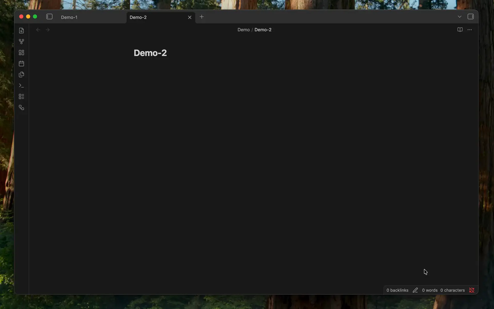
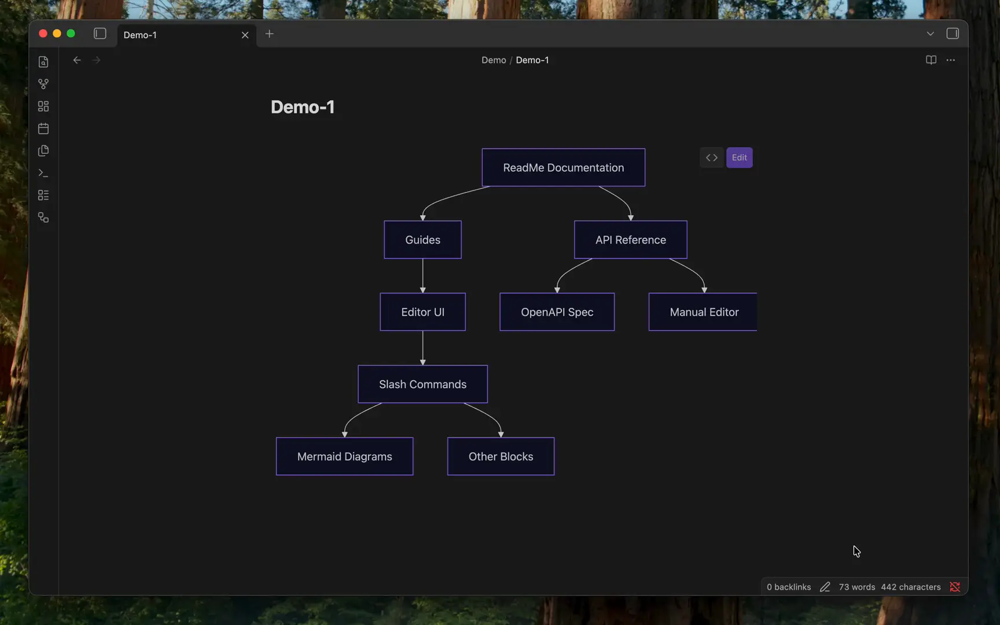
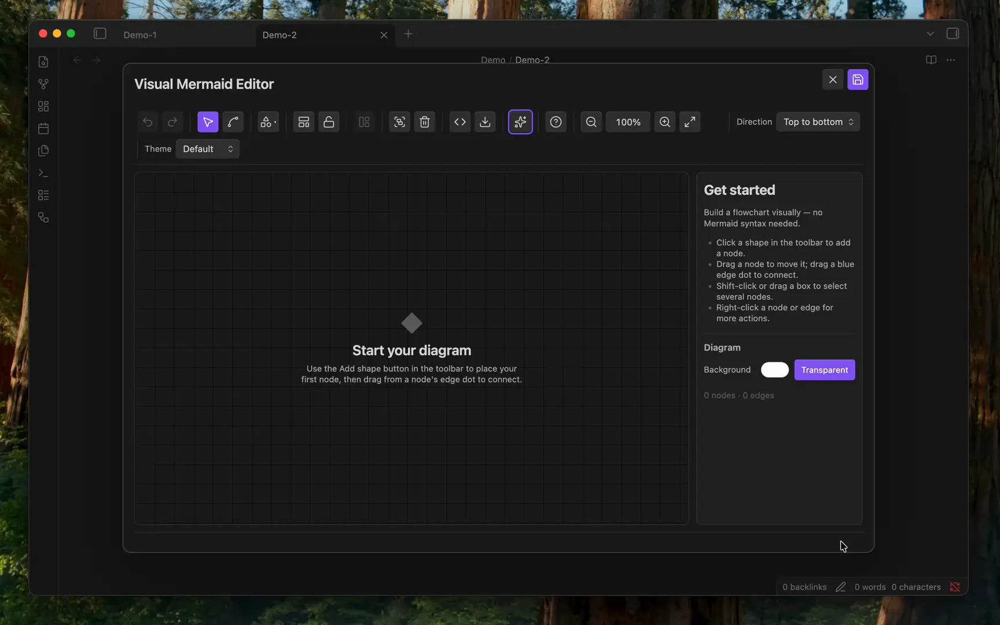

# Mermaid Flow

**A visual, drag-and-drop editor for [Mermaid](https://mermaid.js.org/) flowcharts inside [Obsidian](https://obsidian.md/).**

Build and rearrange diagrams by moving nodes and drawing connections — Mermaid Flow writes the underlying `mermaid` code for you, so no syntax knowledge is required.

Your edits **round-trip safely**: Mermaid Flow reads your existing Mermaid blocks, lets you edit them visually, and writes them back — preserving YAML frontmatter, comments, accessibility titles, custom styles, and advanced directives without loss.

---

## ✨ Features

### 🎨 Visual Diagramming & Canvas
- **Full-Bleed Canvas Surface** — Open, edge-to-edge canvas with an infinite grid background, smooth mouse panning, spacebar pan, trackpad gestures, and wheel navigation.
- **Marquee Selection (Rubber-Band)** — Drag a box across the canvas background to multi-select nodes for batch styling, moving, or grouping.
- **Mobile Multi-Touch Gestures** — Full support for touchscreens and mobile devices featuring two-finger panning and pinch-to-zoom with strict pointer isolation.
- **Dynamic Quick Actions** — Instantly add a sequential "Step after", a perpendicular "Parallel sibling" from the same parent, or a two-way "Yes/No branch".
- **Auto-Layout & Smart Guides** — Automatically arrange nodes with one click, or move nodes freely with dynamic visual alignment guides and optional grid snapping.
- **Auto-Hiding Floating Properties Panel** — Choose between a docked sidebar or a floating panel overlay that automatically fades out while dragging elements.
- **Full-Width Responsive Toolbar** — Multi-row flex-wrapping toolbar that adapts to narrow viewports with collision protection for pinned Save and Discard buttons.

### 🧩 Nodes, Shapes & Subgraphs
- **Diverse Node Shapes** — Rectangles, rounded rectangles, stadiums, cylinders, diamonds, hexagons, parallelograms, circles, asymmetric subroutines, and more.
- **Semantic Style Presets** — Instantly format nodes with draw.io-style semantic roles: *Start*, *End*, *Process*, *Decision*, and *Data / IO*.
- **Multi-Line Text Editing** — Auto-expanding textareas with `Shift+Enter` for multi-line labels on nodes and edges, rendered via centered SVG `<tspan>` layout.
- **Rich Text Styling** — Format labels using inline `<b>`, `<i>`, and `` tags that render as styled text just like native Obsidian Mermaid previews.
- **Nested Subgraphs & Group Inheritance** — Group nodes into subgraphs, manage parent-child subgraph hierarchies with cycle safety, and automatically inherit group membership when creating child or sibling nodes.
- **Custom ClassDef Management** — Create, style, and assign reusable Mermaid `classDef` styles, with a dedicated delete button that safely cleans up class references across all nodes and groups.

### 🔗 Edge & Connection Controls
- **Edge Style Presets** — One-click styling for links including *Default*, *Dependency (Dashed)*, *Emphasis (Thick)*, *Muted*, and *Line (Undirected)*.
- **Arrow Types & Direction** — Directed arrows (`-->`), open links (`---`), dotted links (`-.->`), thick links (`==>`), and one-click edge reversal.
- **Animated Links & Reconnection** — Toggle animated flows or drag edge endpoints between nodes to quickly rewire workflows.

### 🤖 AI Flowchart Assistant (Optional)
- **Prompt-to-Diagram** — Describe a workflow in natural language to generate a Mermaid flowchart instantly.
- **Broad Provider Support** — Connect via OpenAI, Google Gemini, Anthropic Claude, Ollama (local), OpenRouter, or LM Studio.

### 🛠️ Workflow & Integration
- **Zero Syntax Knowledge Needed** — Mermaid Flow generates clean, valid Mermaid code in the background as you draw.
- **Bidirectional Live Code View** — Toggle the live raw Mermaid code view side-by-side; edits made to text immediately update the visual canvas and vice versa.
- **Flexible Workspace Modes** — Edit in a full-featured Modal overlay, vertical split pane, or dedicated workspace tab.
- **Component Snippet Library** — Save frequently used diagram fragments and subtrees into your vault's component library for easy insertion.
- **Persistent Layouts** — Node positions are stored in clean, non-intrusive `%% mermaid-flow:pos` comments, so your custom layout survives reloads while remaining 100% readable by any standard Mermaid viewer.
- **Works Across All Modes** — Launch the visual editor directly from Reading mode, Live Preview, or Source mode.

---

## 🎬 See it in Action

### Edit an Existing Diagram

Click **Edit** on any rendered Mermaid block in Reading mode or Live Preview to rearrange it visually — your advanced syntax, comments, and YAML frontmatter are preserved on save.

### Generate with AI

Describe the process you want and let your configured AI provider draft the flowchart, then polish it on the canvas.

---

## 🚀 Getting Started

### Installation

1. In Obsidian, go to **Settings → Community plugins**.
2. Turn off *Restricted mode* (if enabled).
3. Click **Browse** and search for **Mermaid Flow**.
4. Click **Install**, then **Enable**.

You can also visit the [Obsidian Community Plugin Directory page](https://community.obsidian.md/plugins/mermaid-flow).

### Quick Usage

- **Create a new diagram:** Click the Mermaid Flow ribbon icon, or open the Command Palette (<kbd>Ctrl</kbd>/<kbd>Cmd</kbd>+<kbd>P</kbd>) and run **Mermaid Flow: Insert visual Mermaid diagram**.
- **Edit an existing diagram:** Click the **Edit** action button in the top-right corner of any rendered Mermaid block, or position your cursor inside a `mermaid` code block and run **Mermaid Flow: Edit Mermaid diagram visually**.
- **Save your work:** Click **Save** in the floating action pill to commit the diagram back to your note, or enable **Auto-save** in settings/pane view for continuous synchronization.

---

## ⌨️ Keyboard Shortcuts & Gestures

| Shortcut / Gesture | Action |
| :--- | :--- |
| **Click + Drag (Canvas)** | Marquee selection (rubber-band box to select multiple nodes) |
| **Two-Finger Drag (Touch)** | Pan canvas surface |
| **Pinch / Spread (Touch)** | Pinch-to-zoom canvas |
| **Shift + Click** | Toggle node in/out of multi-selection |
| **Space + Click-Drag** | Pan canvas (desktop) |
| **Middle-Click Drag** | Pan canvas |
| **Mouse Wheel** | Zoom in / Zoom out |
| **Double-Click Background** | Add a new node at the cursor position |
| **Double-Click Node** | Quick in-place label editing |
| **Shift + Enter** | Insert newline in label editor |
| **Cmd / Ctrl + Z** | Undo |
| **Cmd / Ctrl + Shift + Z** (or **Cmd + Y**) | Redo |
| **Delete / Backspace** | Delete selected node, edge, or group |

---

## 🔒 Safe Round-Trip Integrity

The parser and serializer strictly adhere to a **"never drop a line"** design invariant:
- **Mermaid v10.5+ YAML Frontmatter** (`---` ... `---`) is kept at the top of the block with indentation preserved.
- **Contextual Comments (`%%`)** remain anchored to the nodes, edges, or subgraphs they annotate.
- **Accessibility Metadata (`accTitle` and `accDescr`)** round-trips natively.
- **Unsupported / Advanced Statements** (such as custom `click` handlers, hyperlinked interactions, or complex directives) are safely held in internal buffers and re-emitted without corruption.

---

## 🗺️ Roadmap

### Completed Milestones
- [x] Full visual drag-and-drop flowchart editor with freeform node positioning
- [x] Edge-to-edge full-bleed canvas with hidden scrollbars and open grid background
- [x] Multi-touch gestures for mobile/tablet (two-finger pan, pinch-to-zoom)
- [x] Marquee (rubber-band) drag-to-select for multi-node operations
- [x] Multi-line label editing with `Shift+Enter` and centered SVG multi-line rendering
- [x] Subgraph grouping with nested parent hierarchies and cycle prevention
- [x] Automatic subgraph inheritance for connected children and duplicated nodes
- [x] Reusable semantic node presets (*Start*, *End*, *Process*, *Decision*, *Data / IO*)
- [x] Reusable edge presets (*Default*, *Dependency*, *Emphasis*, *Muted*, *Line*)
- [x] Custom `classDef` creation, styling, and one-click deletion across diagrams
- [x] Safe round-tripping for YAML frontmatter, scoped comments, and advanced Mermaid syntax
- [x] Rich text formatting (`<b>`, `<i>`, ``) without innerHTML
- [x] AI flowchart generation and prompt-based refinement (HTTP APIs: OpenAI, Claude, Gemini, Ollama, OpenRouter, LM Studio)
- [x] Flexible editor layouts: Modal popup, Split pane, or New workspace tab
- [x] Component snippet library for saving and reusing diagram blocks

### Up Next
- [ ] Subgraph-to-node and subgraph-to-subgraph visual edge rendering on the canvas
- [ ] Custom user-saved style presets for nodes and links
- [ ] Configurable visual alignment guide thresholds and snap tolerances
- [ ] Direct export to high-resolution PNG / SVG with transparent background options
- [ ] Extended visual editing for Sequence diagrams, Mindmaps, and ER diagrams

---

## ☕ Support Development

If Mermaid Flow saves you time and enhances your Obsidian note-taking experience, consider supporting ongoing development:

---

## 🤝 Contributing

Contributions, bug reports, and suggestions are always welcome!
- Check existing issues or open a new one on [GitHub Issues](https://github.com/THANSHEER/obsidian-mermaid-flow/issues).
- See the [Contribution Guide](docs/CONTRIBUTING.md) and [Architecture Overview](docs/ARCHITECTURE.md) to set up the development environment.

---

## 📄 License

Licensed under the [GNU General Public License v3.0](LICENSE).
