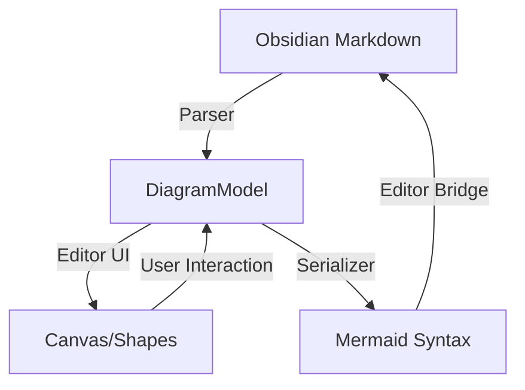

# Architecture Overview: Mermaid Flow

This document explains the technical structure of the Mermaid Flow plugin to help contributors understand how data flows through the application.

## 核心 (Core) Philosophy
Mermaid Flow acts as a visual "wrapper" around Mermaid syntax. It parses Mermaid code blocks into an internal JavaScript model, allows the user to manipulate that model visually, and then serializes it back into Mermaid syntax.

## Data Flow Diagram



## Folder Structure

- `src/main.ts`: The plugin entry point. Handles Obsidian commands, ribbon icons, and view registrations.
- `src/model.ts`: Defines the `DiagramModel` interface (Nodes, Edges, Shapes, Directions).
- `src/parser.ts`: Converts raw Mermaid string into `DiagramModel`.
- `src/serializer.ts`: Converts `DiagramModel` back into Mermaid string.
- `src/editorView.ts`: The main workspace view for the "Embedded Pane" mode.
- `src/canvas.ts`: Handles the logic for rendering and interacting with the flowchart elements.
- `src/editorBridge.ts`: Logic for reading and writing to the Obsidian Editor (locating blocks, replacing text).

## Persistent Layouts
Standard Mermaid does not store node coordinates. Mermaid Flow solves this by appending a specialized comment to the Mermaid block:
```mermaid
%%{
  "positions": {
    "node1": {"x": 100, "y": 200}
  }
}%%
```
The parser reads this to restore the layout, and the serializer updates it on every save.
