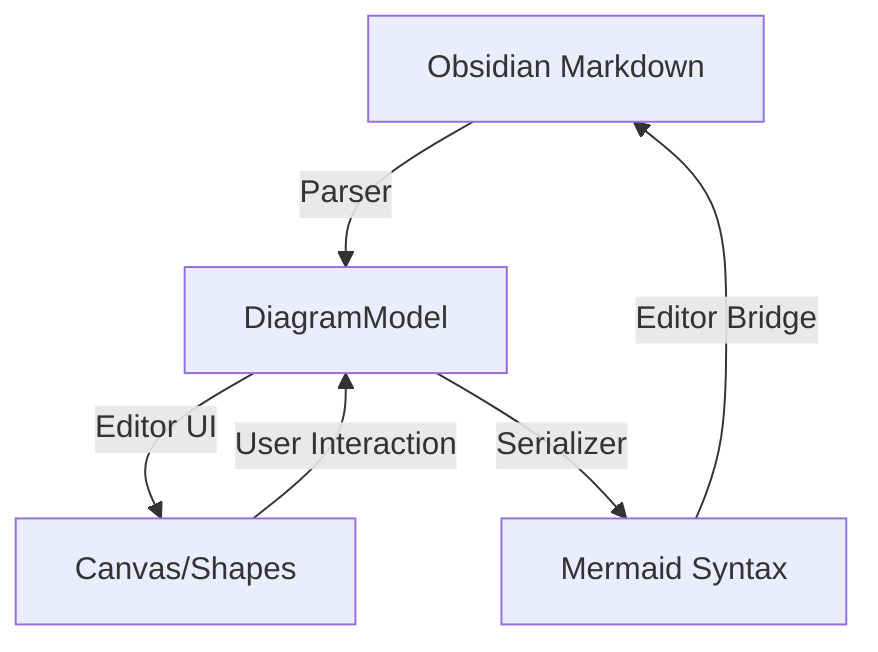

# Architecture Overview: Mermaid Flow

This document explains the technical structure of the Mermaid Flow plugin to help contributors understand how data flows through the application.

## Core Philosophy

Mermaid Flow acts as a visual "wrapper" around Mermaid syntax. It parses Mermaid code blocks into an internal JavaScript model, allows the user to manipulate that model visually, and then serializes it back into Mermaid syntax.

## Data Flow Diagram


```mermaid
graph TD
    A[Obsidian Markdown] -->|Parser| B[DiagramModel]
    B -->|Editor UI| C[Canvas/Shapes]
    C -->|User Interaction| B
    B -->|Serializer| D[Mermaid Syntax]
    D -->|Editor Bridge| A
```

## Folder Structure

- `src/main.ts`: The plugin entry point. Handles Obsidian commands, ribbon icons, and view registrations.
- `src/model.ts`: Defines the `DiagramModel` interface (Nodes, Edges, Shapes, Directions, nested Groups).
- `src/parser.ts`: Converts raw Mermaid string into `DiagramModel`.
- `src/serializer.ts`: Converts `DiagramModel` back into Mermaid string.
- `src/editorView.ts`: The main workspace view for the "Embedded Pane" mode.
- `src/canvas.ts`: Handles the logic for rendering and interacting with the flowchart elements.
- `src/editorBridge.ts`: Logic for reading and writing to the Obsidian Editor (locating blocks, replacing text).
- `src/diagramType.ts`: Detects Mermaid diagram kinds; sequence/mindmap/ER route to `AltDiagramModal`, while unsupported kinds fall back to the code viewer.
- `src/ai/`: Optional AI generation (HTTP providers + desktop-only CLI).

## Persistent Layouts

Standard Mermaid does not store node coordinates. Mermaid Flow solves this by appending a specialized comment to the Mermaid block (Mermaid ignores `%%` lines, so the diagram stays valid):

```text
%% mermaid-flow:pos A=100,200,120,40 B=240,60
```

Each token is `id=x,y` or `id=x,y,w,h` (centre coordinates; optional width/height). The parser reads this to restore the layout, and the serializer updates it on every save when "Remember positions" is enabled.

## Alternate diagram types

Sequence, mindmap, and ER use dedicated models under `src/altDiagrams/` (not `DiagramModel`). `diagramType.ts` routes those blocks to `AltDiagramModal` instead of the flowchart canvas.

## Round-trip safety

Anything the parser cannot interpret is pushed into `model.extras` and re-emitted verbatim on save so advanced syntax is never dropped.
